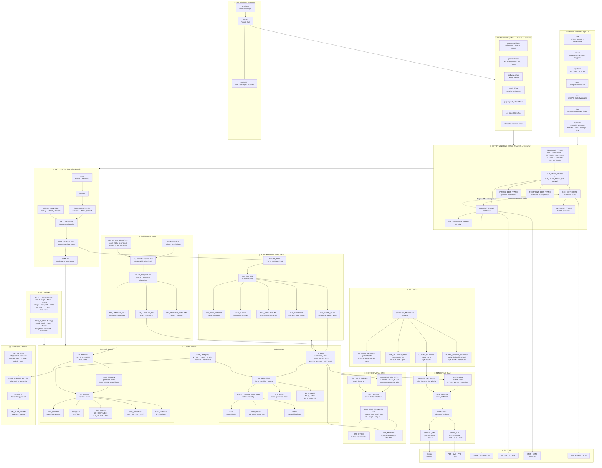

# KiCad C++ Source Architecture

This document describes the system architecture of the KiCad 8.99 source mirror (`kicad-source-mirror/`), focusing on module organization, key subsystems, and design patterns.

**Scope:** Windows build (MSVC x64 Release) targeting C++20, wxWidgets 3.3.1, OpenGL, Protobuf 3.21.12, vcpkg.

---

## 0. End-to-End System Architecture Diagram

Below is a single comprehensive Mermaid diagram showing the entire KiCad system from application launch to output. This is the **developer handover diagram** — when a new developer joins or takes over the project, this diagram explains how every major subsystem connects and flows.



**Legend:**
- **① → ⑭:** Numbered subsystems showing the flow from application startup to final output
- **Arrows:** Data/control flow between components
- **Dotted lines:** Async messaging (KIWAY mail) between editor windows
- **Subgraphs:** Logical layers (launch → libraries → frames → tools → domain → rendering → I/O → output)

---

## 1. Overview

KiCad is an open-source EDA (Electronic Design Automation) suite for schematic design, PCB layout, and 3D visualization. The source tree compiles into:

- **Shared libraries** (`*.dll`) — shared utilities and framework
- **DSO plugins** (`*.kiface`) — modular editor engines (schematic, PCB, Gerber, etc.)
- **Executable** (`kicad.exe`) — project manager and launcher

The architecture uses a **plugin-based design** where the main application (`kicad.exe`) loads editor modules at runtime via the **KIWAY/KIFACE** inter-process communication bus, avoiding monolithic dependencies and enabling incremental compilation.

---

## 2. Build Artifact Architecture

### Shared Libraries

| Library | Source | Purpose | Depends On |
|---------|--------|---------|-----------|
| `core.dll` | `libs/core/` | Minimal utilities (UTF-8, base64, observable, profiling) | — |
| `kimath.dll` | `libs/kimath/` | Geometry math (vectors, angles, bezier, polygons, transforms) | core |
| `kiplatform.dll` | `libs/kiplatform/` | Platform abstraction (OS-specific paths, DPI, UI helpers) | core |
| `sexpr.dll` | `libs/sexpr/` | S-expression parser/writer (KiCad file format) | — |
| `kinng.dll` | `libs/kinng/` | nng (nanomsg-next-gen) IPC socket wrapper | — |
| `kiapi.dll` | `api/` | Protobuf generated message types and serialization | — |
| `kicommon.dll` | `common/` | **Central framework**: frames, tools, settings, rendering, git, OAuth, CURL, fonts | core, kimath, kiplatform, sexpr, kinng, kiapi |

### DSO Plugin Architecture (`.kiface` modules)

Each `.kiface` is a shared library loaded on demand by the `kicad` launcher:

| DSO | Editor | Provides |
|-----|--------|----------|
| `eeschema.kiface` | Schematic | Schematic editor, symbol editor, symbol viewer, SPICE simulator |
| `pcbnew.kiface` | PCB | PCB editor, footprint editor, footprint viewer, P&S router, DRC engine |
| `gerbview.kiface` | Viewer | Gerber file viewer |
| `cvpcb.kiface` | Tools | Footprint assignment tool |
| `pagelayout_editor.kiface` | Tools | Page layout / drawing sheet editor |
| `pcb_calculator.kiface` | Tools | Electrical calculator |
| `bitmap2component.kiface` | Tools | Image to PCB artwork converter |

**Dependency:** All `.kiface` modules depend on `kicommon.dll` for the framework (`EDA_BASE_FRAME`, `TOOL_MANAGER`, `SETTINGS_MANAGER`, etc.).

### Executable

| Artifact | Source | Role |
|----------|--------|------|
| `kicad.exe` | `kicad/` | Project manager launcher; loads `.kiface` DSOs on demand via KIWAY |

---

## 3. Module Dependency Hierarchy

```
External Dependencies:
  wxWidgets 3.3.1, OpenGL, Boost 1.71+, Freetype, HarfBuzz, Fontconfig,
  ngspice, OpenCASCADE 7.5+, Protobuf 3.21.12, libgit2, CURL, nng, SQLite3

       ↓

  ┌─ libs/
  │  ├─ core.dll
  │  ├─ kimath.dll
  │  ├─ kiplatform.dll
  │  ├─ sexpr.dll
  │  └─ kinng.dll
  │
  ├─ api/
  │  └─ kiapi.dll  (protobuf-generated)
  │
  └─ common/
     └─ kicommon.dll  (owns TOOL_MANAGER, SETTINGS_MANAGER, GAL, IPC API server)
            ↓
        ┌───┴──────┬──────────┬──────────┬──────────┬──────────┬──────────┐
        │          │          │          │          │          │          │
    eeschema   pcbnew     gerbview   3d-viewer  cvpcb     pagelayout  bitmap2
    .kiface    .kiface    .kiface    (DSO)     .kiface    _editor     component
                          (DSO)                .kiface    .kiface     .kiface
        │          │          │          │          │          │          │
        └────┬─────┘          │          │          │          │          │
             │                │          │          │          │          │
             └────────────────┼──────────┼──────────┼──────────┴──────────┘
                              ↓
                           kicad.exe  (launcher)
```

**Key principle:** The `kicad.exe` launcher does NOT depend on any `.kiface` modules. DSOs are loaded at runtime via `dlopen()` and `GetProcAddress()`, enabling:
- Hot-swapping of editors without rebuilding the launcher
- Parallel compilation of independent modules
- Reduced binary size through dynamic loading

---

## 4. KIWAY/KIFACE Inter-Module Bus

The **KIWAY (KiCad Interface Architecture)** is KiCad's internal software bus, documented in `include/kiway.h`. It enables loose coupling between editor modules.

### Architecture

```
      PROJECT  (project file, settings, symbol/footprint libraries)
        ↑
        │
      KIWAY  (one per open project; message bus)
        ↓
     ┌──┴──┬──────┬──────┬──────┬──────┐
     ↓     ↓      ↓      ↓      ↓      ↓
   KIFACE (abstract interface each DSO must implement)
     ↓
   KIWAY_PLAYER (wxFrame window participating in the bus)
     ↓
   Editor windows (SCH_EDIT_FRAME, PCB_EDIT_FRAME, etc.)
```

### Key Classes

- **`KIFACE`** (`include/kiface.h`) — Abstract interface each `.kiface` must implement:
  - `OnKifaceStart()` — initialize module (called once on load)
  - `CreateKiWindow()` — create editor window and return `KIWAY_PLAYER*`
  - `IfaceOrAddress()` — get address of an interface or `nullptr`

- **`KIFACE_BASE`** (`include/kiface_base.h`) — Concrete base with lifecycle management

- **`KIWAY`** (`include/kiway.h`) — Project-level bus:
  - Maintains `PROJECT*` (settings, file path, libraries)
  - Dispatches messages via `ExpressMail(FRAME_T, MAIL_TYPE, void*)`
  - Messages are async; no direct DSO-to-DSO function calls

- **`KIWAY_PLAYER`** (`include/kiway_player.h`) — `wxFrame` that participates in KIWAY:
  - Base class for all editor windows
  - Can send/receive `MAIL_TYPE` messages to other editors
  - Example: PCB editor sends "activate symbol" mail to schematic editor

- **`KIWAY_HOLDER`** (`include/kiway_holder.h`) — Mixin for any object needing KIWAY access:
  - Used by tool classes, dialogs, utility classes
  - Call `GetKiway()` to access the bus

### Message Types

`MAIL_TYPE` enumeration (a large `enum class`) includes:
- `MAIL_SCH_ANNOTATION_ROWS_ADDED` — schematic annotation change
- `MAIL_PCB_MODEL_UPDATE` — PCB model updated
- `MAIL_CROSS_PROBE` — sync selection between editors
- `MAIL_UPDATE_CHILD_SIZER` — UI layout change
- And ~30 more...

### Design Rationale

- **Decouples** editors from each other; they communicate via well-defined messages
- **Enables** loading/unloading editors at runtime without recompilation
- **Avoids** circular dependencies (eeschema → pcbnew → eeschema)
- **Supports** scripting; Python can drive multiple editors via the same KIWAY

---

## 5. Frame/Window Class Hierarchy

```
wxFrame  (wxWidgets base frame class)
  │
  └─ EDA_BASE_FRAME  (include/eda_base_frame.h)
     │
     │ Owns:
     │  - TOOL_MANAGER (tool system, coroutine scheduler)
     │  - SETTINGS_MANAGER (JSON settings, color themes)
     │  - ACTION_TOOLBAR (toolbar with icon buttons for actions)
     │  - WX_INFOBAR (message bar)
     │ Mixins:
     │  - KIWAY_HOLDER (access to KIWAY bus)
     │  - TOOLS_HOLDER (exposes TOOL_MANAGER)
     │  - UNITS_PROVIDER (mm vs inches)
     │
     └─ EDA_DRAW_FRAME  (include/eda_draw_frame.h)
        │
        │ Owns:
        │  - EDA_DRAW_PANEL_GAL (the OpenGL/Cairo canvas)
        │  - RENDER_SETTINGS + PAINTER (style + renderer)
        │
        ├─ SCH_BASE_FRAME  (eeschema/sch_base_frame.h)
        │  │
        │  ├─ SCH_EDIT_FRAME           — schematic editor
        │  ├─ SYMBOL_EDIT_FRAME        — symbol library editor
        │  └─ SYMBOL_VIEWER_FRAME      — symbol preview window
        │
        └─ PCB_BASE_FRAME  (include/pcb_base_frame.h)
           │
           │ Owns:
           │  - BOARD* (the PCB model)
           │  - PCB_DRAW_PANEL_GAL (specialized canvas for PCB)
           │
           └─ PCB_BASE_EDIT_FRAME
              │
              ├─ PCB_EDIT_FRAME         — full PCB editor
              └─ FOOTPRINT_EDIT_FRAME   — footprint library editor

Other major frames (not in this hierarchy):
  - KICAD_MANAGER_FRAME  (kicad/) — project manager
  - EDA_3D_VIEWER_FRAME  (3d-viewer/) — 3D PCB view
  - SIMULATOR_FRAME      (eeschema/sim/) — SPICE simulator
```

### Frame Name Constants

All frame types have string identifiers in `include/eda_draw_frame.h`:
- `SCH_EDIT_FRAME_NAME` = `"SchematicFrame"`
- `PCB_EDIT_FRAME_NAME` = `"PcbFrame"`
- `SYMBOL_EDIT_FRAME_NAME` = `"SymbolEditorFrame"`
- etc.

These are used by `KIWAY` to address messages to specific frame types.

---

## 6. Core Domain Object Model

All domain objects inherit from **`EDA_ITEM`** (`include/eda_item.h`), which provides:
- **`KICAD_T`** type enum (identifies object as `PCB_PAD_T`, `SCH_SYMBOL_T`, etc.)
- **`KIID`** (UUID) for unique identification
- **`EDA_ITEM_FLAGS`** (flags: selected, modified, etc.)
- **`Visit()`** and iterator support for tree traversal
- **`Serialize()`/`Deserialize()`** for protobuf API

### PCB Domain (`pcbnew/`)

```
EDA_ITEM
  │
  └─ BOARD_ITEM  (include/board_item.h)
     │ Defines: layer membership (LSET), parent BOARD*, position
     │
     ├─ BOARD_CONNECTED_ITEM  (items with electrical nets)
     │  │
     │  ├─ PAD  (pcbnew/pad.h)
     │  │   └─ Inherits: PADSTACK (via composition)
     │  │
     │  ├─ PCB_TRACK  (pcbnew/pcb_track.h)  — trace segment
     │  │  ├─ PCB_ARC   — curved trace
     │  │  └─ PCB_VIA   — via (multi-layer connection)
     │  │
     │  └─ ZONE  (pcbnew/zone.h)  — copper fill polygon
     │
     ├─ FOOTPRINT  (pcbnew/footprint.h)  — placed component with pads + graphic items
     │   └─ Contains: PADs, PCB_SHAPEs, PCB_TEXTs, PCB_FIELDS
     │
     ├─ PCB_SHAPE  (pcbnew/pcb_shape.h)  — graphic shape (line, arc, circle, polygon, etc.)
     ├─ PCB_TEXT   (pcbnew/pcb_text.h)   — text element
     ├─ PCB_TEXTBOX (pcbnew/pcb_textbox.h) — text in a box
     ├─ PCB_TABLE / PCB_TABLECELL       — table grid
     ├─ PCB_DIMENSION  (pcbnew/pcb_dimension.h) — dimension annotation
     ├─ PCB_TARGET  (pcbnew/pcb_target.h) — target marker
     ├─ PCB_MARKER  (pcbnew/pcb_marker.h) — DRC violation marker
     ├─ PCB_GROUP  (pcbnew/pcb_group.h) — logical grouping
     └─ PCB_GENERATOR  (pcbnew/pcb_generator.h) — parametric shape generator

BOARD  (pcbnew/board.h)  — TOP-LEVEL PCB CONTAINER
  │ Owns:
  │  - std::vector<BOARD_ITEM*> (all items)
  │  - NETINFO_LIST (electrical nets: net names, net codes)
  │  - CONNECTIVITY_DATA (netlist graph, ratsnest)
  │  - BOARD_DESIGN_SETTINGS (layer stack, clearance rules, DRC settings)
  │  - Zone fill data (polygon outlines for rendering)
  │
  └─ Used for: board file (*.kicad_pcb), DRC, routing, export
```

### Schematic Domain (`eeschema/`)

```
EDA_ITEM
  │
  └─ SCH_ITEM  (eeschema/sch_item.h)
     │
     ├─ SCH_SYMBOL  (eeschema/sch_symbol.h)  — placed component instance
     │   └─ Inherits: EDA_SHAPE (for rotation/position)
     │
     ├─ SCH_SHEET  (eeschema/sch_sheet.h)  — sheet reference (hierarchical)
     │
     ├─ SCH_PIN  (eeschema/sch_pin.h)  — visible pin (not from symbol)
     │
     ├─ SCH_LINE  (eeschema/sch_line.h)  — wire or bus segment
     │   └─ Inherits: EDA_SHAPE
     │
     ├─ SCH_BUS_ENTRY  (eeschema/sch_bus_entry.h)  — bus entry junction
     ├─ SCH_JUNCTION    (eeschema/sch_junction.h)  — wire junction dot
     │
     ├─ SCH_LABEL / SCH_HIERLABEL / SCH_GLOBALLABEL  — net labels
     │   └─ Inherit: EDA_TEXT
     │
     ├─ SCH_NO_CONNECT  — no-connect marker
     ├─ SCH_FIELD       — component field (reference, value, footprint, etc.)
     ├─ SCH_TEXT / SCH_TEXTBOX — comment text
     ├─ SCH_SHAPE       — graphic shape
     ├─ SCH_TABLE / SCH_TABLECELL
     ├─ SCH_GROUP       — logical grouping
     └─ SCH_MARKER      — ERC violation marker

LIB_SYMBOL  (eeschema/lib_symbol.h)  — symbol definition in library
  │ Not placed; defines template for SCH_SYMBOL instances
  │ Owns: pins, graphic items, fields

SCHEMATIC  (eeschema/schematic.h)  — TOP-LEVEL SCHEMATIC CONTAINER
  │ Owns:
  │  - Root SCH_SHEET (hierarchy)
  │  - Schematic settings + ERC state
  │  - Library reference data
  │
  └─ SCH_SCREEN  (eeschema/sch_screen.h)  — per-sheet item container
     │ Owns:
     │  - std::vector<SCH_ITEM*> (items on this sheet)
     │  - SCH_RTREE (spatial R-Tree index for fast lookups)
     │
     └─ Used for: sheet view rendering, hit testing, item queries
```

### Shared Mixins

- **`EDA_SHAPE`** (`include/eda_shape.h`) — Geometry mixin (lines, arcs, circles, polygons, bezier curves)
- **`EDA_TEXT`** (`include/eda_text.h`) — Text mixin (font, size, justification, rotation, attributes)

---

## 7. Rendering Architecture (GAL)

**GAL** = **Graphics Abstraction Layer** — A rendering abstraction that allows KiCad to switch between hardware-accelerated and software rendering without code changes.

```
KIGFX::GAL  (include/gal/graphics_abstraction_layer.h)
  │ Pure virtual interface: DrawLine, DrawCircle, DrawPolygon, etc.
  │
  ├─ KIGFX::OPENGL_GAL  (common/gal/opengl/)
  │  │ Hardware-accelerated rendering (GPU shader-based)
  │  │ Used: Normal editing, fast panning/zooming
  │  │
  │  └─ Renders to: OpenGL framebuffer
  │
  └─ KIGFX::CAIRO_GAL  (common/gal/cairo/)
     │ Software rendering (CPU rasterization)
     │ Used: Printing, PDF export, headless rendering
     │
     └─ Renders to: Cairo surface (bitmap, PDF, SVG, etc.)

KIGFX::VIEW  (common/view/view.cpp)  — Scene graph
  │ Owns:
  │  - std::vector<VIEW_ITEM*> (renderable objects)
  │  - Layer visibility, zoom level, pan offset
  │  - R-Tree spatial index (for fast visibility culling)
  │
  ├─ Uses: GAL for drawing, PAINTER for style
  └─ Called by: EDA_DRAW_PANEL_GAL::Paint()

KIGFX::VIEW_ITEM  (include/view/view_item.h)
  │ Interface: GetBBox(), Draw(PAINTER, RENDER_SETTINGS), HitTest()
  │ Implemented by: EDA_ITEM subclasses
  │
  └─ Inherits: KIGFX::VIEW_ITEM_DATA (visibility, render flags)

KIGFX::PAINTER  (include/gal/painter.h)  — Per-domain rendering strategy
  │
  ├─ PCB_PAINTER  (pcbnew/pcb_painter.h)
  │  │ Draws: pads, traces, zones, footprints, DRC markers, etc.
  │  │ Uses layer colors from PCB_RENDER_SETTINGS
  │  │
  │  └─ Handles: layer transparency, filled vs outline modes
  │
  └─ SCH_PAINTER  (eeschema/sch_painter.h)
     │ Draws: symbols, wires, labels, junctions, etc.
     │ Uses layer colors from SCH_RENDER_SETTINGS
     │
     └─ Handles: symbol rotation, text rendering, ERC markers

KIGFX::RENDER_SETTINGS  (include/gal/render_settings.h)
  │ Pure virtual: color palette, line widths, etc.
  │
  ├─ PCB_RENDER_SETTINGS  (pcbnew/pcb_render_settings.h)
  │  └─ Owns: copper layer colors, silkscreen, assembly, etc.
  │
  └─ SCH_RENDER_SETTINGS  (eeschema/sch_render_settings.h)
     └─ Owns: wire, symbol, label colors, etc.

EDA_DRAW_PANEL_GAL  (common/widgets/eda_draw_panel_gal.h)  — wxWidgets canvas
  │ A wxPanel that:
  │  - Creates/owns a GAL instance (OPENGL_GAL or CAIRO_GAL)
  │  - Pumps wxEvents into VIEW_CONTROLS
  │  - Calls VIEW::Redraw() on paint events
  │  - Translates mouse/keyboard events to tool input
```

### Rendering Flow

```
1. EDA_DRAW_PANEL_GAL::Paint() (wxPaintEvent)
2. → KIGFX::VIEW::Redraw()
3. → for each VIEW_ITEM in visibility range:
     KIGFX::PAINTER::Draw(VIEW_ITEM, RENDER_SETTINGS)
4. → calls GAL::DrawLine/DrawCircle/etc
5. → GAL routes to OPENGL_GAL or CAIRO_GAL
6. → GPU/CPU rendering to screen/surface
```

---

## 8. Tool System (Coroutine-Based)

The **tool system** is KiCad's event-driven command framework. It uses **C++20 coroutines** (or `libcontext` on older compilers) to implement **asynchronous, reentrant tool state machines**.

```
TOOL_MANAGER  (include/tool/tool_manager.h)  — Master scheduler
  │ Owns:
  │  - std::vector<TOOL_BASE*> (all registered tools)
  │  - Current active tool reference
  │  - Tool ID allocator
  │
  ├─ Methods:
  │  - RegisterTool(TOOL_BASE*)
  │  - InvokeTool(TOOL_ID) — activate tool coroutine
  │  - ProcessEvent(wxEvent) — dispatch event to active tool
  │  - RunAction(TOOL_ACTION) — async action invocation
  │
  └─ Updates TOOL_DISPATCHER with event routing

TOOL_BASE  (include/tool/tool_base.h)  — Abstract base
  │ Each tool is a *reentrant* object that can be:
  │  - Activated (tool coroutine starts)
  │  - Paused (GetAndWait() suspends, awaiting input)
  │  - Resumed (event arrives, coroutine resumes)
  │  - Deactivated (tool returns)
  │
  └─ Virtual: void Main()  (tool entry point, usually runs to completion)

TOOL_INTERACTIVE  (include/tool/tool_interactive.h)
  │ Base for all editing tools
  │ Provides: GetAndWait(TOOLS_EVENT&) — await next event in coroutine
  │ Tools call: GetAndWait(evt) → blocks until event occurs
  │ Under the hood: Suspends coroutine, TOOL_MANAGER resumes when event fires
  │
  └─ Example usage:
     ```cpp
     class ROUTE_TOOL : TOOL_INTERACTIVE {
         void Main() {
             while (true) {
                 TOOL_EVENT evt;
                 GetAndWait(evt);  // suspend, await click/move/key
                 if (evt.IsAction(&ROUTE_START))
                     RouteTrack();
             }
         }
     };
     ```

TOOL_ACTION  (include/tool/tool_action.h)  — Named action descriptor
  │ Defines:
  │  - Unique ID (hash of tool + action name)
  │  - Display name, icon, scope (editor/view/any)
  │  - Hotkey binding (if any)
  │  - Argument flags (param type, optional)
  │
  └─ Used by: menus, toolbars, hotkey dispatch

ACTION_MANAGER  (include/tool/action_manager.h)  — Action registry
  │ Owns:
  │  - std::map<TOOL_ACTION*, TOOL_ENTRY> (tool + action → handler)
  │  - Hotkey → action mapping
  │
  ├─ Methods:
  │  - RegisterAction(TOOL_ACTION)
  │  - GetHotKey(action) → wxKeyCode
  │  - FindAction(name) → TOOL_ACTION*
  │
  └─ Used by: menus, dialogs to bind actions

TOOL_DISPATCHER  (include/tool/tool_dispatcher.h)  — Event translator
  │ Converts wxEvents → TOOL_EVENTs:
  │  - wxMouseEvent → TOOL_EVENT_MOUSE
  │  - wxKeyEvent → TOOL_EVENT_KEY
  │  - ACTION_ACTIVATED → TOOL_EVENT_ACTION
  │
  └─ Feeds events to TOOL_MANAGER::ProcessEvent()

TOOL_EVENT  (include/tool/tool_event.h)  — Generic event type
  │ Union of: mouse, keyboard, action, command events
  │ Provides: IsClick(), IsDoubleClick(), IsDrag(), Position(), etc.
  │
  └─ Used by: tools to respond to user input
```

### Tool Implementations

- **`common/tool/`** — Shared tools (zoom, pan, grid toggle, properties panel, selection, picking)
- **`pcbnew/tools/`** — PCB tools (place pad, route trace, DRC, edit field, etc.) — ~25 tools
- **`eeschema/tools/`** — Schematic tools (place symbol, draw wire, place label, etc.) — ~20 tools

### Tool Activation Flow

```
1. User clicks menu item or presses hotkey
2. → ACTION_MANAGER resolves action → TOOL_ACTION
3. → TOOL_MANAGER::RunAction(TOOL_ACTION)
4. → TOOL_MANAGER::InvokeTool(tool_id)
5. → Tool coroutine Main() starts / resumes
6. → Tool calls GetAndWait(evt)  [coroutine suspended]
7. → User moves mouse / clicks / presses key
8. → wxEvent → TOOL_DISPATCHER → TOOL_EVENT
9. → TOOL_MANAGER::ProcessEvent(event)
10. → Resumes suspended coroutine with event
11. → Tool processes event, may call GetAndWait() again
12. → Tool finishes, tool coroutine exits
```

---

## 9. I/O Plugin Architecture

KiCad supports importing/exporting many EDA formats. The design uses **plugin factories** (`*_IO_MGR`) and **abstract base classes** (`*_IO`) to avoid hardcoding format support.

### PCB I/O (`pcbnew/pcb_io/`)

```
PCB_IO  (pcbnew/pcb_io/pcb_io.h)  — Abstract base
  │ Pure virtual:
  │  - LoadBoard(filename) → BOARD*
  │  - SaveBoard(filename, BOARD*, opts)
  │  - FootprintLibInfo() → LIB_INFO
  │  - FootprintEnumerate() → footprint names
  │  - FootprintLoad(lib, name) → FOOTPRINT*
  │  - FootprintSave(lib, FOOTPRINT*)
  │
  └─ Implemented by: 15+ format plugins

PCB_IO_MGR  (pcbnew/pcb_io/pcb_io_mgr.h)  — Factory registry
  │ Static factory: GetInstance(PCB_FILE_T type)
  │ Supported formats (PCB_FILE_T enum):
  │  - KICAD_SEXP (native, primary)
  │  - KICAD_LEGACY (v5 and earlier)
  │  - EAGLE
  │  - ALTIUM_CIRCUIT_MAKER / ALTIUM_DESIGNER
  │  - CADSTAR_PCB
  │  - ALLEGRO
  │  - EASYEDA / EASYEDA_PRO
  │  - PADS_ASCII
  │  - FABMASTER
  │  - GEDA_PCB
  │  - IPC2581
  │  - ODBPP
  │  - PCAD_PLUGINS
  │  - SPRINT_LAYOUT
  │
Format-specific plugins:
  │
  ├─ kicad_sexp/   (pcbnew/pcb_io/kicad_sexp/)  — S-expression format (*.kicad_pcb)
  │  └─ Handles: boards, footprints, footprint libraries
  │
  ├─ eagle/  (common/io/eagle/)  — Autodesk Eagle (*.brd, *.lbr)
  ├─ altium/  (common/io/altium/)  — Altium Designer
  ├─ cadstar/  (common/io/cadstar/)  — Cadstar
  ├─ easyeda/  (common/io/easyeda/)  — EasyEDA
  ├─ pads/  (common/io/pads/)  — PADS ASCII
  │
  └─ [other format plugins]
```

### Schematic I/O (`eeschema/sch_io/`)

```
SCH_IO  (eeschema/sch_io/sch_io.h)  — Abstract base
  │ Pure virtual:
  │  - LoadSchematicFile(filename) → SCHEMATIC*
  │  - SaveSchematicFile(filename, SCHEMATIC*)
  │  - SymbolLibInfo() → LIB_INFO
  │  - EnumerateSymbolLib(lib) → symbol names
  │  - LoadSymbol(lib, name) → LIB_SYMBOL*
  │  - SaveSymbol(lib, LIB_SYMBOL*)
  │
  └─ Implemented by: 10+ format plugins

SCH_IO_MGR  (eeschema/sch_io/sch_io_mgr.h)  — Factory registry
  │ Supported formats (SCH_FILE_T enum):
  │  - KICAD_SEXP (native, primary)
  │  - KICAD_LEGACY
  │  - EAGLE
  │  - ALTIUM
  │  - CADSTAR
  │  - LTSPICE
  │  - EASYEDA / EASYEDA_PRO
  │  - PADS_LOGIC
  │  - GEDA_PCB
  │  - HTTP_LIB (online symbol library)
  │  - DATABASE (SQL symbol library)
  │
Format-specific plugins:
  │
  ├─ kicad_sexp/  (eeschema/sch_io/kicad_sexp/)  — S-expression format (*.kicad_sch)
  │  └─ Handles: schematics, symbols, symbol libraries
  │
  ├─ eagle/  (common/io/eagle/)
  ├─ altium/  (common/io/altium/)
  ├─ cadstar/  (common/io/cadstar/)
  ├─ easyeda/  (common/io/easyeda/)
  ├─ pads/  (common/io/pads/)
  │
  └─ [other format plugins]
```

### Shared Parsers (`common/io/`)

To avoid duplication, common parsers for multi-format support:
- `altium/` — Altium Designer (used by both PCB and schematic)
- `cadstar/` — Cadstar (used by both)
- `eagle/` — Eagle (used by both)
- `easyeda/` — EasyEDA (used by both)
- `pads/` — PADS (used by both)

---

## 10. IPC / External API Layer

The **modern IPC API** enables external applications to control KiCad programmatically. It uses **Protobuf** messages sent over a **Unix domain socket** (nng).

### Architecture

```
External Process (Python script, C++ client, etc.)
  │
  ├─ connect() → $TMPDIR/kicad/api.sock
  ├─ send(ApiRequest protobuf)
  └─ recv(ApiResponse protobuf)
       ↓
  nng IPC socket
       ↓
  KICAD_API_SERVER  (common/api/api_server.cpp)
    │ Listens on UNIX domain socket
    │ Dispatches incoming ApiRequest by protobuf type URL
    │ Routes to API_HANDLER subclass
    │
    ├─ Owns: std::map<TypeUrl, API_HANDLER*>
    │
    └─ Calls: handler->Handle(ApiRequest) → ApiResponse

API_HANDLER  (include/api/api_handler.h)  — Abstract dispatcher
  │ Pure virtual: Handle(ApiRequest) → ApiResponse
  │
  ├─ API_HANDLER_COMMON  (common/api/api_handler_common.cpp)
  │  └─ Handles: project operations, settings operations, type info queries
  │
  ├─ API_HANDLER_EDITOR  (include/api/api_handler.h)  — Abstract base
  │  │
  │  ├─ API_HANDLER_PCB  (pcbnew/api/api_handler_pcb.cpp)
  │  │  └─ Handles: PCB-specific operations (add pad, get board items, DRC, etc.)
  │  │
  │  └─ API_HANDLER_SCH  (eeschema/api/api_handler_sch.cpp)
  │     └─ Handles: schematic-specific operations (add symbol, get netlist, etc.)
  │
  └─ Extensible: new handlers can be registered at runtime
```

### Protobuf Messages (`api/proto/`)

| Proto File | Defines |
|---|---|
| `common/envelope.proto` | `ApiRequest`, `ApiResponse` (message wrappers) |
| `common/types/base_types.proto` | Coordinate types, KIID, colors, layers |
| `common/types/enums.proto` | Shared enums (layer types, connector types, etc.) |
| `common/commands/base_commands.proto` | SetPropertyRequest, GetPropertyRequest (generic operations) |
| `common/commands/editor_commands.proto` | GetVersionRequest, ListTypeInfoRequest, ListSymbolPropertiesRequest |
| `common/commands/project_commands.proto` | OpenProjectRequest, SaveProjectRequest, CreateBoardRequest, GetBoardRequest |
| `board/board.proto` | BOARD message (board items, netlist, settings) |
| `board/board_types.proto` | PAD, PCB_TRACK, ZONE, FOOTPRINT message types |
| `board/board_commands.proto` | GetBoardRequest, SetBoardRequest, SetPcbItemsRequest |
| `board/board_jobs.proto` | DRC job, connectivity job request/response |
| `schematic/schematic_types.proto` | SCH_SYMBOL, SCH_LINE, SCH_LABEL message types |
| `schematic/schematic_commands.proto` | GetSchematicRequest, SetSchematicItemsRequest |
| `schematic/schematic_jobs.proto` | ERC job request/response |

### Code Generation

- `api/` directory contains `.proto` files
- CMake invokes `protoc` (protobuf compiler) to generate:
  - `*.pb.h` / `*.pb.cc` — C++ message classes
  - Placed in build output directory
  - Compiled into `kiapi.dll` (a shared library, required because protobuf has global statics)

### Serialization

- **`SERIALIZABLE`** (`include/api/serializable.h`) — Interface on `EDA_ITEM`:
  ```cpp
  virtual bool Serialize(google::protobuf::Any& aContainer) const = 0;
  virtual bool Deserialize(const google::protobuf::Any& aContainer) = 0;
  ```
- When API_HANDLER saves a board item, it calls `item->Serialize()` → converts `PAD*` to `kiapi::board.v1.Pad` protobuf message
- When API_HANDLER creates a board item from protobuf, it calls `item->Deserialize()` to reconstruct C++ object

### Plugin System

- **`API_PLUGIN`** (`include/api/api_plugin.h`) — Represents an external plugin
- **`API_PLUGIN_MANAGER`** (`include/api/api_plugin_manager.h`) — Plugin lifecycle
  - Scans plugin directories (e.g., `~/.config/kicad/plugins/`)
  - Reads JSON descriptor (plugin name, icon, version, entry executable)
  - Launches external process
  - Routes tool actions to plugin via IPC socket

---

## 11. Connectivity & Design Rule Check (DRC)

The **connectivity engine** and **DRC system** are critical for PCB design.

### Connectivity (`pcbnew/connectivity/`)

```
CONNECTIVITY_DATA  (pcbnew/connectivity/connectivity_data.h)
  │ Manages the electrical netlist graph
  │
  ├─ Owns:
  │  - Net database (net IDs, net names, net codes)
  │  - Item-to-net associations
  │  - From-to connectivity (for length matching, impedance matching)
  │  - Ratsnest (unrouted connections, visual feedback)
  │
  └─ Updates: incrementally as user edits board

CONNECTIVITY_ALGO  (pcbnew/connectivity/connectivity_algo.h)
  │ Algorithm for computing netlist from board
  │
  ├─ BuildConnectivityGraph() — full computation
  ├─ UpdateFromEditor() — incremental update (fast)
  │
  └─ Used by: DRC engine, auto-router, ERC

CONNECTIVITY_ITEMS
  │ Abstractions over BOARD_ITEM for connectivity:
  │  - std::vector<BOARD_CONNECTED_ITEM*> — items with nets
  │  - std::vector<std::vector<CN_ITEM>> — grouped by electrical net
  │
  └─ Used by: connectivity algorithm to traverse graph
```

### DRC Engine (`pcbnew/drc/`)

```
DRC_ENGINE  (pcbnew/drc/drc_engine.h)  — Main orchestrator
  │ Owns:
  │  - DRC_RULE_SET (set of design rules parsed from .kicad_dru file)
  │  - std::vector<DRC_TEST_PROVIDER*> (all test providers)
  │
  ├─ Methods:
  │  - LoadRuleSet(filename) → parses .kicad_dru
  │  - Run() → runs all test providers, collects violations
  │  - ClearMarkers() → removes all DRC markers from board
  │
  └─ Used by: DRC dialog, PCB editor background checks

DRC_RULE / DRC_RULE_SET
  │ Parsed from .kicad_dru (text file format)
  │
  ├─ Constraints: clearance, via diameter, via annulus, hole size, track width,
  │              matched length, diff pair gap/width, solder mask clearance, etc.
  │
  ├─ Conditions: net/footprint/layer selectors (e.g., "clearance: 0.2mm where netA & netB")
  │
  └─ Example rule:
     ```
     (rule "Trace clearance"
       (constraint clearance (min 0.2mm))
       (condition "A.Type == 'track' && B.Type == 'track'"))
     ```

DRC_RULE_PARSER  (pcbnew/drc/drc_rule_parser.h)
  │ Parses .kicad_dru syntax and builds DRC_RULE_SET
  │
  └─ Called by: DRC_ENGINE::LoadRuleSet()

DRC_TEST_PROVIDER  (pcbnew/drc/drc_test_provider.h)  — Abstract base
  │ Each provider checks one category of violations
  │
  ├─ Virtual: Run() → std::vector<DRC_VIOLATION>
  │
  └─ Concrete implementations (~25):
     - TP_COPPER_CLEARANCE — copper-to-copper spacing
     - TP_DIFF_PAIR — differential pair width/gap
     - TP_MATCHED_LENGTH — trace length matching tolerance
     - TP_HOLE_SIZE — via hole diameter constraints
     - TP_COURTYARD — footprint courtyard overlap
     - TP_SILK_CLEARANCE — silkscreen-to-copper clearance
     - TP_TEXT_SIZE / TP_TEXT_THICKNESS
     - TP_FOOTPRINT — footprint-specific checks
     - TP_CONNECTION — unconnected pins, shorted nets
     - TP_SCHEMATIC_PARITY — board vs schematic mismatch
     - [and ~15 more]

DRC_RTREE  (pcbnew/drc/drc_rtree.h)
  │ R-Tree spatial index for efficient clearance queries
  │
  ├─ Insert all board items (pads, traces, zones) with bounding boxes
  ├─ Query(BBox) → nearby items (used for clearance checks)
  │
  └─ Dramatically speeds up: TP_COPPER_CLEARANCE, TP_COURTYARD, etc.
```

### DRC Workflow

```
1. User clicks "Tools → Electrical Rules Check"
2. → DRC_FRAME dialog opens
3. → User selects rules, markers to display
4. → "Run DRC" button clicked
5. → DRC_ENGINE::Run()
6. → For each DRC_TEST_PROVIDER:
     - Load rules from DRC_RULE_SET
     - Query DRC_RTREE for nearby items
     - Apply constraint checking
     - Collect violations → DRC_VIOLATION
7. → DRC_VIOLATION added to BOARD as PCB_MARKER
8. → Markers displayed in PCB editor with issue description
9. → Click marker → jump to location
```

---

## 12. Push-and-Shove Interactive Router

The **P&S router** (`pcbnew/router/`) is an advanced interactive routing tool using topology-aware algorithms.

```
PNS_ROUTER  (pcbnew/router/pns_router.h)  — Main router control
  │ State machine: IDLE → ROUTE_STARTED → ROUTE_IN_PROGRESS → ROUTE_DONE
  │
  ├─ Methods:
  │  - StartRouting(start_pos, layer, net)
  │  - UpdateHead(cursor_pos) → updates routing preview
  │  - FixRoute() → commits route to board
  │  - UndoLastSegment()
  │
  └─ Owns: current PNS_LINE being routed, routing obstacles, optimization state

PNS_LINE_PLACER  (pcbnew/router/pns_line_placer.h)
  │ Handles single-line placement (straight traces and autorouting)
  │
  ├─ Methods:
  │  - Start(pos, ITEM*) → begin routing from position or pad
  │  - Route(pos) → update interactive preview
  │  - CommitPlacement() → add trace to board
  │
  └─ Features: ortho mode, free-angle, corner style (45°/90°), shove avoidance

PNS_SHOVE  (pcbnew/router/pns_shove.h)
  │ **Push-and-Shove algorithm**: automatically moves/pushes existing traces to make room
  │
  ├─ Topology-aware: understands trace connections, vias, pads
  ├─ Iterative: may recursively shove other traces (cascade)
  │
  └─ Result: compact, connected routing without manual trace adjustment

PNS_WALKAROUND  (pcbnew/router/pns_walkaround.h)
  │ Alternative routing strategy: walk around obstacles instead of pushing
  │
  └─ Less aggressive than shove; useful for constrained layouts

PNS_OPTIMIZER  (pcbnew/router/pns_optimizer.h)
  │ Post-processing: shortens routed traces while respecting clearances
  │
  ├─ Strategies: smooth corners, remove unnecessary vias, consolidate traces
  │
  └─ Result: cleaner, shorter routes

PNS_NODE  (pcbnew/router/pns_node.h)
  │ Graph node representing a routing vertex (via, pad, trace endpoint)
  │
  └─ Connectivity: edges to connected nodes (used by walkaround algorithm)

PNS_KICAD_IFACE  (pcbnew/router/pns_kicad_iface.h)
  │ Adapter from PNS (generic routing library) to KiCad BOARD model
  │
  ├─ Methods:
  │  - GetItems() → converts BOARD items to PNS items
  │  - AddItem() / RemoveItem() → synchronize changes
  │
  └─ Decouples: router algorithm from BOARD representation (could be reused)

ROUTE_TOOL  (pcbnew/tools/tool_route.h)  — User-facing routing tool
  │ Coroutine-based TOOL_INTERACTIVE
  │
  ├─ Main() loop:
  │  1. GetAndWait(click on pad or trace start)
  │  2. PNS_ROUTER::StartRouting()
  │  3. GetAndWait(mouse move) → PNS_ROUTER::UpdateHead()
  │  4. GetAndWait(click to place corner / right-click to finish)
  │  5. PNS_ROUTER::FixRoute() → commit to board
  │
  └─ Features:
     - Diff pair routing (maintain width/gap between paired signals)
     - Meander tuning (add slack to adjust trace length)
     - Length tuning (target matched length for high-speed signals)
     - Multi-drag (grab and move existing traces while routing)
```

---

## 13. Settings System

All user preferences, window state, color themes, etc. are stored in **JSON files** managed by a hierarchical settings system.

```
JSON_SETTINGS  (common/settings/json_settings.h)
  │ Base class for all settings objects
  │
  ├─ Methods:
  │  - Load(filename) → parse JSON, populate param tree
  │  - Save(filename) → serialize param tree to JSON
  │  - GetParam(name) → retrieve parameter value
  │  - SetParam(name, value) → set parameter (triggers change events)
  │
  ├─ Owns:
  │  - std::map<std::string, PARAM*> (all parameters)
  │  - Watchers (subscribers to changes)
  │
  └─ Subclasses:
     - APP_SETTINGS_BASE — per-application settings
     - COLOR_SETTINGS — color theme JSON files
     - COMMON_SETTINGS — global user preferences
     - NESTED_SETTINGS — settings embedded within a parent object

APP_SETTINGS_BASE  (common/settings/app_settings.h)
  │ Per-application settings: windows state, visibility, last used paths
  │
  ├─ Subclasses:
  │  - SCH_EDIT_FRAME_SETTINGS (eeschema/)
  │  - PCB_EDIT_FRAME_SETTINGS (pcbnew/)
  │  - SYMBOL_EDIT_FRAME_SETTINGS (eeschema/)
  │  - 3D_VIEWER_SETTINGS (3d-viewer/)
  │  - etc.
  │
  └─ Parameters: window size/position, pan/zoom, grid spacing, layer colors

COLOR_SETTINGS  (common/settings/color_settings.h)
  │ Color theme (palette) used for rendering
  │
  ├─ Subclasses:
  │  - PCB_COLORS (PCB layer colors, copper, silk, assembly, etc.)
  │  - SCH_COLORS (wire, symbol, label, background, etc.)
  │
  ├─ Sources:
  │  - Built-in themes: default.json, KiCad default, user custom
  │  - User ~/.config/kicad/colors/ *.json files
  │
  └─ Format: theme name, layer → RGB color, layer visibility on/off

COMMON_SETTINGS  (common/settings/common_settings.h)
  │ Global user preferences shared across all apps
  │
  ├─ Parameters:
  │  - Unit system (mm vs inches)
  │  - Grid spacing
  │  - Appearance (light/dark theme)
  │  - Hotkey bindings
  │  - Library search paths
  │  - File history
  │
  └─ Stored: ~/.config/kicad/common.json

NESTED_SETTINGS  (common/settings/nested_settings.h)
  │ Settings embedded within another JSON object
  │
  ├─ Example: BOARD_DESIGN_SETTINGS lives within a *.kicad_pcb file
  │
  ├─ Used for: per-board design rules, per-project settings
  │
  └─ Inherits: JSON_SETTINGS (same Load/Save interface)

BOARD_DESIGN_SETTINGS  (pcbnew/board_design_settings.h)
  │ Per-board settings: layer stack, clearance rules, trace widths, vias
  │
  ├─ Lives in: .kicad_pcb file (as JSON object "design_settings")
  │
  ├─ Parameters:
  │  - Copper layer count, layer names
  │  - Via sizes (diameter, hole)
  │  - Default track width
  │  - Clearance (trace-to-trace, copper-to-edge)
  │  - Solder mask / paste clearances
  │  - Text sizes (reference, value, comment)
  │
  └─ Used by: DRC engine (constraints), layout tools (defaults)

SETTINGS_MANAGER  (common/settings/settings_manager.h)  — Singleton
  │ Master registry of all settings objects
  │
  ├─ Owns:
  │  - COMMON_SETTINGS (global)
  │  - APP_SETTINGS_BASE per app (schematic, PCB, 3D, etc.)
  │  - COLOR_SETTINGS (loaded themes)
  │
  ├─ Methods:
  │  - GetSettings(APP_NAME) → APP_SETTINGS_BASE*
  │  - LoadColorSettings(theme_name) → COLOR_SETTINGS*
  │  - SaveSettings() → persists all to disk
  │
  └─ Lifecycle: created at app startup, destroyed at shutdown
```

### Settings Storage Locations

- **Global:** `~/.config/kicad/common.json` (hotkeys, libraries, appearance)
- **Per-app:** `~/.config/kicad/eeschema`, `~/.config/kicad/pcbnew/`, etc. (window state)
- **Colors:** `~/.config/kicad/colors/*.json` (user-defined themes)
- **Project:** `<project>/<project>.kicad_pcb`, `.kicad_sch` (embedded BOARD_DESIGN_SETTINGS, schematic settings)

---

## 14. SPICE Simulation (eeschema/sim/)

KiCad integrates **ngspice** (a circuit simulator) for inline transient, AC, and operating-point analysis.

```
SIMULATOR_FRAME  (eeschema/sim/simulator_frame.h)
  │ Main simulation window (wxFrame)
  │
  ├─ Owns:
  │  - SPICE_CIRCUIT_MODEL (schematic → netlist converter)
  │  - SIM_PLOT_FRAME (waveform plotting)
  │  - NGSPICE wrapper
  │
  └─ Tabs: "Simulator" (for transient), "DC Op Point", etc.

SPICE_CIRCUIT_MODEL  (eeschema/sim/spice_circuit_model.h)
  │ Converts schematic (SCH_SYMBOL, SCH_FIELD, nets) to SPICE netlist
  │
  ├─ Process:
  │  1. Traverse schematic (SCHEMATIC → SCH_SCREEN → SCH_ITEM)
  │  2. For each SCH_SYMBOL: lookup SIM_MODEL
  │  3. Get SPICE model string from SIM_MODEL
  │  4. Generate netlist: .include, .model, component instances, sources
  │
  └─ Output: `.cir` format netlist (Spice3-compatible)

SIM_MODEL  (eeschema/sim/sim_model.h)  — Per-component SPICE model
  │
  ├─ Subclasses:
  │  - SIM_MODEL_IDEAL (ideal resistor, capacitor, inductor)
  │  - SIM_MODEL_NGSPICE (uses ngspice built-in models)
  │  - SIM_MODEL_BEHAVIORAL (arbitrary expressions: y=f(x))
  │  - SIM_MODEL_SUBCKT (subcircuit reference)
  │  - SIM_MODEL_BJT (bipolar transistor: 2N2222, 2N2907, etc.)
  │  - SIM_MODEL_MOSFET (FET: IRF540, etc.)
  │  - SIM_MODEL_DIODE (D1N4148, etc.)
  │  - SIM_MODEL_R / C / L (ideal passive)
  │  - SIM_MODEL_IBIS (IBIS model file)
  │
  └─ Parameters: model name, SPICE parameters (Vto, Kp, Cgs, etc.)

NGSPICE  (eeschema/sim/ngspice_jobs.h)
  │ Wrapper for `libngspice.dll` (loaded dynamically at runtime via dlopen)
  │
  ├─ Methods:
  │  - LoadCircuit(netlist_text)
  │  - Run(analysis_type) → "tran 0 10m 1m", "ac dec 10 1Hz 1MHz"
  │  - GetPlotNames() → available output vectors
  │  - GetPlotData(name) → voltage/current waveform
  │
  └─ Under the hood: calls ngspice C library functions (ng_init, ng_load, etc.)

SIM_LIB_MGR  (eeschema/sim/sim_lib_mgr.h)
  │ Manages SPICE model libraries (text files with .model/.subckt definitions)
  │
  ├─ Scans: ~/.config/kicad/spice/ and project libraries/
  ├─ Caches: parsed model info
  │
  └─ Used by: SIM_MODEL::LoadModel() to find .model and .subckt definitions

SIM_PLOT_FRAME / SIM_PLOT_PANEL
  │ Waveform plotting (wxPlotCtrl or similar)
  │
  ├─ Displays: voltage, current, power waveforms
  ├─ Interact: zoom, pan, measure, export to CSV/PNG
  │
  └─ Updated: after simulation run
```

### Simulation Workflow

```
1. User opens "Tools → Simulator" (or Ctrl+Shift+S)
2. → SIMULATOR_FRAME opens
3. → SPICE_CIRCUIT_MODEL converts current schematic to netlist
4. → User enters transient simulation: "tran 0 1m 10u" (0 to 1ms, 10µs step)
5. → "Run" button clicked
6. → NGSPICE::LoadCircuit(netlist_text)
7. → NGSPICE::Run("tran 0 1m 10u")
8. → ngspice solves and returns data
9. → SIM_PLOT_FRAME displays waveforms
10. → User probes nets: click net label → waveform appears
```

---

## Summary Table

| Subsystem | Key Classes | Location |
|-----------|-------------|----------|
| **Build** | CMakeLists.txt, CMakePresets.json | root |
| **KIWAY Bus** | KIWAY, KIFACE, KIWAY_PLAYER, KIWAY_HOLDER | include/kiway*.h, kicad/pcbnew/eeschema |
| **Frames** | EDA_BASE_FRAME, EDA_DRAW_FRAME, PCB_EDIT_FRAME, SCH_EDIT_FRAME | include/, eeschema/, pcbnew/ |
| **Domain Model** | EDA_ITEM, BOARD_ITEM, SCH_ITEM, BOARD, SCHEMATIC | include/eda_item.h, pcbnew/, eeschema/ |
| **Rendering** | KIGFX::GAL, KIGFX::VIEW, KIGFX::PAINTER, EDA_DRAW_PANEL_GAL | include/gal/, common/gal/, common/view/ |
| **Tools** | TOOL_MANAGER, TOOL_BASE, TOOL_ACTION, ACTION_MANAGER | include/tool/, common/tool/, pcbnew/tools/, eeschema/tools/ |
| **I/O** | PCB_IO, PCB_IO_MGR, SCH_IO, SCH_IO_MGR | pcbnew/pcb_io/, eeschema/sch_io/, common/io/ |
| **API** | KICAD_API_SERVER, API_HANDLER, SERIALIZABLE | common/api/, include/api/ |
| **Connectivity** | CONNECTIVITY_DATA, CONNECTIVITY_ALGO | pcbnew/connectivity/ |
| **DRC** | DRC_ENGINE, DRC_TEST_PROVIDER, DRC_RULE | pcbnew/drc/ |
| **Router** | PNS_ROUTER, PNS_LINE_PLACER, PNS_SHOVE, ROUTE_TOOL | pcbnew/router/, pcbnew/tools/ |
| **Settings** | JSON_SETTINGS, SETTINGS_MANAGER, COMMON_SETTINGS, BOARD_DESIGN_SETTINGS | common/settings/ |
| **Simulation** | SIMULATOR_FRAME, SPICE_CIRCUIT_MODEL, SIM_MODEL, NGSPICE | eeschema/sim/ |

---

## Design Principles

1. **Plugin Architecture** — Editors are DSOs loaded on demand; launcher doesn't depend on them
2. **Coroutine-Based Tools** — Tools are event-driven state machines using C++ coroutines
3. **Message Bus** — KIWAY enables loose coupling between editors via async messages
4. **Abstraction Layers** — GAL (rendering), I/O plugins (formats), API handlers (external control)
5. **Incremental Rendering** — GAL + VIEW for efficient screen updates
6. **Domain Separation** — PCB and schematic have independent domain models (BOARD, SCHEMATIC)
7. **Extensibility** — Settings, color themes, formats, and API handlers can be extended without modifying core code
8. **Test Coverage** — `qa/` directory contains Boost.Test unit tests for critical subsystems

---

## Quick Reference: Key Headers

| Header | Purpose |
|--------|---------|
| `include/eda_item.h` | Root domain object class |
| `include/eda_base_frame.h` | Base frame class |
| `include/kiway.h`, `kiway_holder.h` | Inter-module bus |
| `include/board_item.h`, `pcb_base_frame.h` | PCB classes |
| `include/gal/painter.h`, `view/view_item.h` | Rendering interfaces |
| `include/tool/tool_manager.h`, `tool_base.h` | Tool system |
| `pcbnew/pcb_io/pcb_io.h`, `eeschema/sch_io/sch_io.h` | I/O plugin bases |
| `include/api/api_server.h`, `api_handler.h` | External API |
| `pcbnew/drc/drc_engine.h` | DRC main class |
| `pcbnew/router/pns_router.h` | P&S router |
| `common/settings/settings_manager.h` | Settings registry |
| `eeschema/sim/simulator_frame.h` | Simulation UI |
